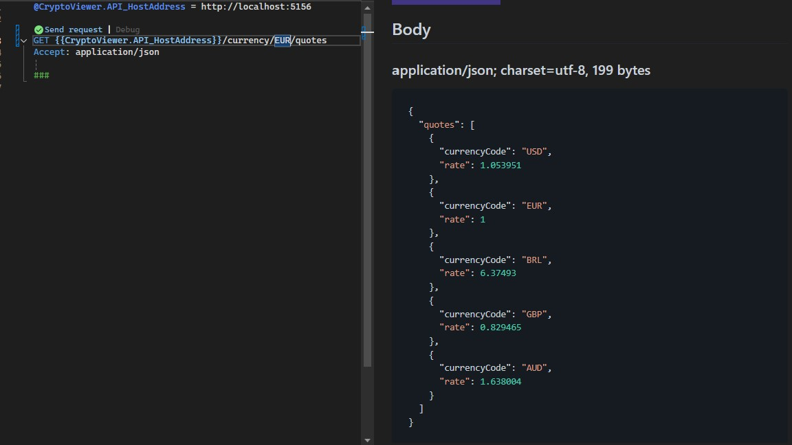
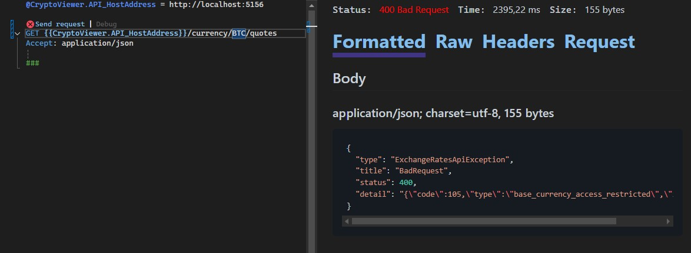

# CryptoViewer

I've used a layered approach where the core "business logic" is implemented in the `CryptoViewer.Application` project.
The `CryptoViewer.Application` project uses a vertical slice approach for implementing the feature(s) - I've used `Mediatr` package to implement this.
Validation of data is done using the `FluentValidation` library .
The `IExchangeService` contract defined in the `CryptoViewer.Application` project is implemented in the `CryptoViewer.Infrastructure` project as a typed HttpClient.
`CryptoViewer.Infrastructure` contains:
- the HttpClient implementation 
- the settings class needed to configure the service (baseUrl, access key and as a setting the list of currencies to be retrieved)
- models needed to deserialize the responses from ExchangeRatesApi.io service
- exception class used to communicate any errors from the HttpClient

The `CryptoViewer.Application` and the `CryptoViewer.Infrastructure` projects are being consumed by a .NET Core Web API using Controllers.
The possible validation errors (from the Application project) or HttpClient implementation errors are being converted
to appropriate HTTP Status Codes using the IExceptionHandler middleware. The error details are using the `ProblemDetails` format. 

In order to call successfully the ExchangeRatesAPI, the `CryptoViewer.API` project defines a `ExchangeServiceSettings` configuration section in the `appsettings.Development.json` file.
Since the Access Key for the ExchangeRatesAPI is a secret, I've set this configuration in my local [user secrets](https://learn.microsoft.com/en-us/aspnet/core/security/app-secrets?view=aspnetcore-9.0&tabs=windows) using the `ExchangeServiceSettings:AccessKey` key.

Since all projects in the solution use .NET 9, the API project no longer uses Swagger. If interested in the OpenAPI document generated, go to `/openapi/v1.json` path once running the API project.
The API project also contains a HTTP file that can be used instead of Postman to fetch the quotes in USD, EUR, BRL, GBP and AUD for a given currency code.

## Screenshots

